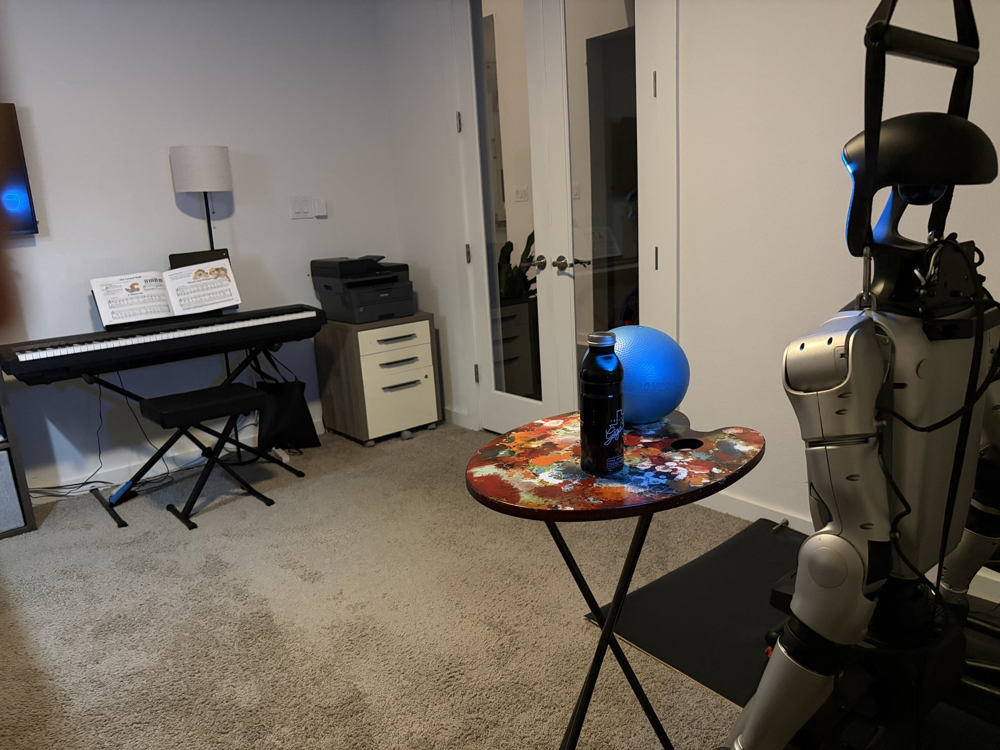

# robotics-connect — on-robot verification

Live bring-up plus sensor/end-effector verification of the `unitree/g1` stack on
a real **Unitree G1 EDU** (aarch64 / Tegra, JetPack L4T), **2026-06-03**.

These results are the ground truth for what the sanitized stack actually does on
hardware — preserved here so they never have to be re-derived.

## Scoreboard

| Test | Result | Notes |
|---|---|---|
| Install (`install/install.sh`) | ✅ | Deployed to `/home/unitree/robotics-connect`, `robotics-connect` conda env cloned from factory `unitree_deploy`, profile hook installed. No collision with existing repos. |
| **Install self-verify (`install.sh --verify`)** | ✅ | **2026-06-10** — one-command probe-based scoreboard: **all 6 checks PASS** (install · arm_fk · camera · rgb · lidar · hands), exit 0. See the dated section below. |
| Depth camera (RealSense D435i) | ✅ | 640×480, ~96% valid pixels, 0.40–5.77 m. |
| RGB camera (Unitree VideoClient/DDS) | ✅ | 1920×1080. |
| LiDAR (Livox MID-360) | ✅ | 62–73k pts/scan, floor −1.24 m; **180° mount-roll correction confirmed**. |
| Arm forward kinematics (`arm_fk`) | ✅ | `SELFTEST_OK` + 9/9 regression, **1005 Hz** on the Jetson. |
| Brainco hand — digits | ✅ | All 6 motors/hand incl. lateral thumb (`thumb_aux`). |
| Brainco hand — touch | ✅ | **10/10** fingertips, clean single press events. |
| Brainco hand — proximity | ✅ | **10/10** fingertips; decode corrected and baked into the bridge. |
| **Brainco hands — USB auto-detect** | ✅ | **2026-06-10** — probe (`brainco_bridge.py --detect`) identifies each hand by Modbus slave id, replacing the hard-coded `ttyUSB1/2`: found `ttyUSB1`→`0x7e` (left), `ttyUSB2`→`0x7f` (right). Robust to port drift across reboots/robots. |
| **GPU vision sidecar (DINOv2 ViT-S/14)** | ✅ | **2026-06-10** — first exercise under the robotics-connect identity: `robotics-connect/vision-sidecar:0.1` built from the in-repo Dockerfile, runs on **GPU** (`device=cuda`, `cuda_available=True`), encodes an RGB frame to the correct **384-d** CLS token at **~27.5 ms/frame** (~10× the ~250 ms CPU fallback). |

**Not yet covered (next run):** walking, torso/waist, and arm motion control
(as fresh clean-room Unitree-SDK diagnostics), and microphone **and speaker** I/O.
*(The `--verify` installer flag and USB-port auto-detect for the hands — previously
listed here — are now done and verified on hardware, 2026-06-10; see above.)*

## Sensor captures

- **RGB + colorized depth** — [`unitree/g1/depth_camera_sight/`](unitree/g1/depth_camera_sight/README.md#sample-capture-on-robot-2026-06-03)
- **LiDAR near field (bottle + ball, x-y and x-z) + mid/far room walls** — [`unitree/g1/lidar_sight/`](unitree/g1/lidar_sight/README.md#sample-capture-on-robot-2026-06-03)

## Hand / USB mappings

Full tables (USB ports, digit motors, touch sensors, proximity sensors) with
measured values live in
[`unitree/g1/brainco_touch/README.md`](unitree/g1/brainco_touch/README.md#on-robot-verification--mappings-2026-06-03).
Key gotchas captured there:

- **USB-port trap** — both hands are channels of a single FTDI quad chip, so
  VID/PID **and serial are identical** across all four `ttyUSB*` ports. A hand
  can only be identified by Modbus probe (left `0x7e`, right `0x7f`), and port
  assignment drifts across robots/reboots — always probe, never hard-assume.
- **Proximity decode** — the per-finger value is `touch_raw[16 + 2·i]` (u16,
  ~0 idle → ~65535 near), now exposed directly as `left_proximity` /
  `right_proximity`.

## Effector ground truth — DOF, morphology, factory gains (2026-06-09)

Read off the **live G1 EDU** during a `discover-robot` pass, captured into the robot descriptor
[`skills/discover-robot/descriptors/unitree_g1_edu.json`](skills/discover-robot/descriptors/unitree_g1_edu.json).
This is the real-to-sim ground truth that the Isaac-staging skills reconcile the 29-DOF sim asset against.

| Fact | Value | Source on the robot |
|---|---|---|
| Body DOF | **23** (12 legs + 1 waist + 10 arms) | 23 revolute joints in `g1_description/g1_23dof_mode_10.urdf` |
| Waist | **yaw only** (no roll/pitch) | URDF + `unitree_sdk2_python` G1JointIndex enum |
| Arms | **5/side** — shoulder p/r/y, elbow, **wrist_roll only** (no wrist pitch/yaw) | URDF (`g1_arm5` SDK example) |
| Absent vs. 29-DOF | `waist_roll`, `waist_pitch`, L/R `wrist_pitch`, L/R `wrist_yaw` | SDK enum marks all six **"INVALID for g1 23dof"** |
| Factory PD gains | legs Kp 60/60/60/100/40/40, waist Kp 60/40/40, arms Kp 40 (Kd legs 1/1/1/2/1/1, arms 1) | `unitree_sdk2_python/example/g1/low_level/g1_low_level_example.py` |
| Head camera tilt | **51.29° down** (floor-plane SVD) | `CAMERA_TILT_DEG_DEFAULT` on-disk |
| Hands | **Brainco** 5-finger (6 motors), over the FTDI **FT4232H** quad | USB (`lsusb`) + `brainco_touch` |
| Sensors on USB | Intel RealSense D435i (`8086:0b3a`) | USB |

> **Real vs. sim.** The physical EDU is **23-DOF with Brainco hands**; the Isaac G1 asset is **29-DOF
> with Inspire hands**. The descriptor records both and locks the 6 absent sim joints so a trained policy
> is transfer-valid. The full **29-DOF** G1 (the common research config) is the clean case where nothing
> is locked — see [`unitree_g1_29dof.json`](skills/discover-robot/descriptors/unitree_g1_29dof.json). The
> 23-DOF EDU is one (reduced) variant, **not** the paradigm.

## 2026-06-10 — installer self-verify + USB-port auto-detect (issue #1)

Two items from the `unitree/g1` next phase ([robotics-connect#1](https://github.com/armwaheed/robotics-connect/issues/1)), built and verified **live on the G1 EDU**.

### `install.sh --verify` — one-command install self-check
Folds the by-hand sensor + hand checks into a single probe-based PASS/FAIL scoreboard (`install/verify.sh`),
so "is this install good?" is provable in one command. Pure software + read-only sensor reads — **no robot
motion**. Live run on the robot:

```
  CHECK     RESULT DETAIL
  -----     ------ ------
  install   PASS   /home/unitree/robotics-connect + 'robotics-connect' env present
  arm_fk    PASS   SELFTEST_OK
  camera    PASS   depth ok  shape=(480, 640)  valid=279064/307200  min=0.376m … (tilt=51.3°)
  rgb       PASS   rgb   ok  shape=(1080, 1920, 3)
  lidar     PASS   center=(-0.97, -0.49, 0.06) … nearest_table_in_front
  hands     PASS   {"left": "/dev/ttyUSB1", "right": "/dev/ttyUSB2"}
[verify] ALL 6 CHECKS PASSED  (exit 0)
```

### USB-port auto-detect (the USB-port trap, solved in code)
`brainco_bridge.py` previously hard-coded `ttyUSB1`/`ttyUSB2`. Because all four FTDI channels share VID/PID
**and serial**, that assignment drifts across robots/reboots. `detect_hand_ports()` now **probes** each
`/dev/ttyUSB*` by Modbus slave id and identifies the hands; the bridge auto-detects by default. Live:

```
$ python brainco_bridge.py --detect
probe: /dev/ttyUSB1 answers Modbus 0x7e -> left hand
probe: /dev/ttyUSB2 answers Modbus 0x7f -> right hand
{"left": "/dev/ttyUSB1", "right": "/dev/ttyUSB2", "scanned": ["/dev/ttyUSB0","/dev/ttyUSB1","/dev/ttyUSB2","/dev/ttyUSB3"]}
```

The current assignment happens to match the old defaults — but it is now **proven by probe**, not assumed,
so a reboot that reshuffles the channels no longer breaks the hands.

### GPU vision sidecar — first verified under the robotics-connect identity
The `vision_sidecar` (containerised DINOv2 ViT-S/14 over local RPC) was present in the repo but had never
been exercised under its own identity on hardware. Verified end-to-end **2026-06-10**:

- `robotics-connect/vision-sidecar:0.1` **built from the in-repo Dockerfile** (`FROM nvcr.io/nvidia/l4t-pytorch:r35.2.1`),
  systemd unit installed + enabled, came up healthy.
- **Ping:** `{'ok': True, 'device': 'cuda', 'load_s': 52.8, 'torch': '2.0.0…nv23.02', 'cuda_available': True}` —
  running on the **Jetson Orin GPU**.
- **Encode:** a 480×640×3 RGB frame returns exactly **1536 bytes = 384 float32** (the DINOv2 CLS token),
  at **median ~27.5 ms/frame** (min 22.7) — matching the design target (~25 ms on the Orin GPU) and ~10×
  faster than the ~250 ms in-process CPU fallback.

The image is built fresh from the public Dockerfile (the private build that previously existed on the
robot is **not** used). The service is now installed + enabled on the robot; `vision_sidecar/uninstall.sh`
removes it.

## Environment



*G1 EDU on a gantry harness facing the artist's-palette table (water bottle +
blue balance ball) in a home office. The glass french doors behind explain the
LiDAR mid/far through-glass returns.*

- Robot: `unitree@192.168.123.164` — G1 EDU, aarch64, `5.10.x-tegra`.
- Factory `unitree_deploy` conda env present; `robotics-connect` env cloned from it.
- Depth via librealsense (`/home/unitree/librealsense/build`); RGB via Unitree
  VideoClient over DDS; LiDAR via DDS topic `rt/utlidar/cloud_livox_mid360`.
