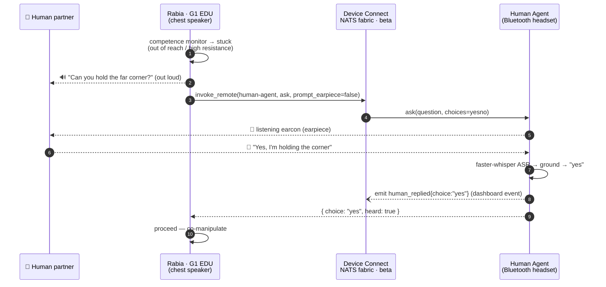
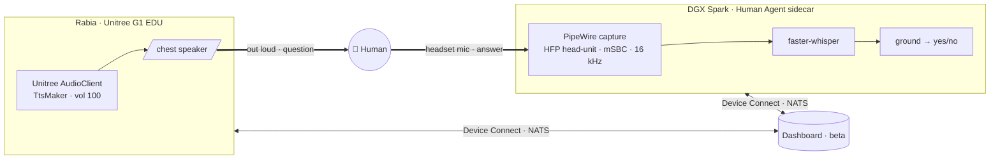
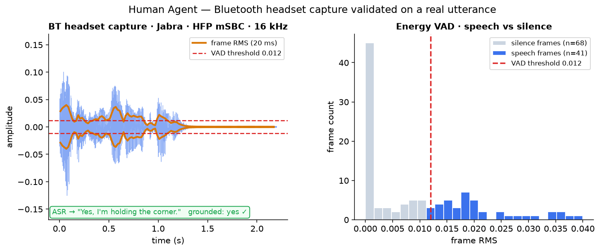
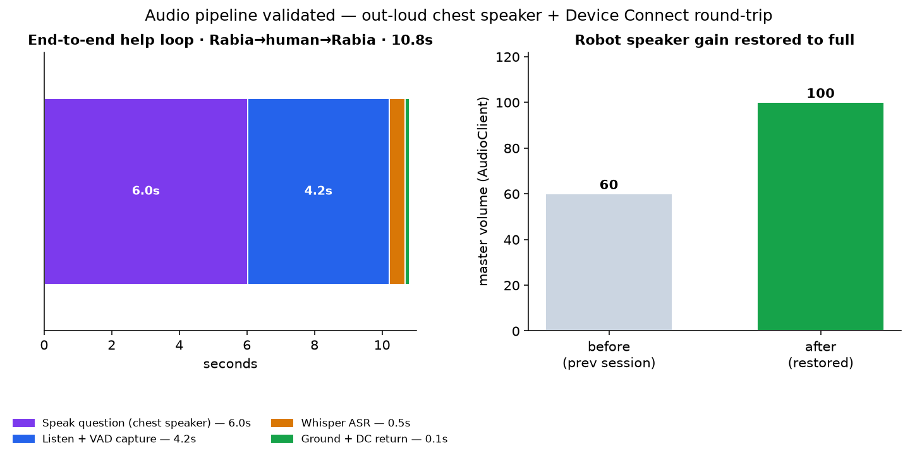
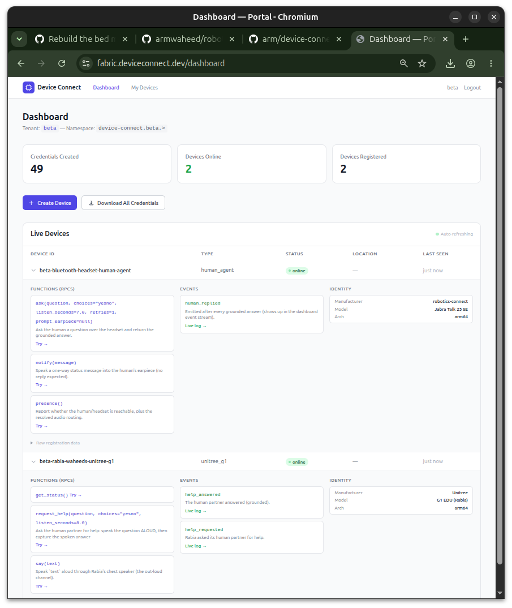
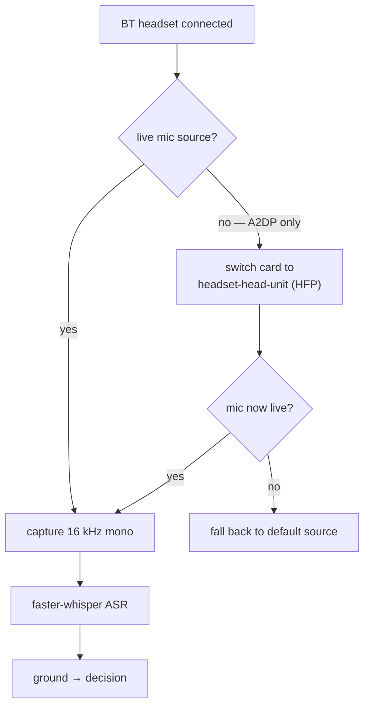

# Human Agent — a person on a Bluetooth headset, as a Device Connect device

When the bed-making robot gets stuck it **asks a human for help**. The robot can't hear (the Unitree
G1 EDU's mic is a closed system — see [`../unitree/g1/voice`](../unitree/g1/voice)), so **Device
Connect is the human↔robot bus**: the robot speaks the question **out loud through its own chest
speaker**, and the human's spoken answer is captured from a **Bluetooth headset** on the compute
node, transcribed, grounded to a decision, and returned over Device Connect. The human shows up on
the dashboard as a first-class device (`device_type=human_agent`) that any robot or agent can
`ask(...)`.

Module: [`human_agent.py`](human_agent.py) (the Device Connect driver) + [`bt_headset.py`](bt_headset.py)
(robust Bluetooth-headset I/O). Built for [armwaheed/robots#3](https://github.com/armwaheed/robots/issues/3).

## The out-loud help loop



**Two channels, decided per direction** (not "speaker vs headset"):
- **Robot → human** (the question): **out loud through the chest speaker** — co-present, legible to
  anyone in the room, and it exercises the robot's real voice. A `--no-earpiece`/`prompt_earpiece`
  toggle swaps to an earpiece-only "quiet mode" (sleeping household, noisy floor) without changing
  any logic.
- **Human → robot** (the answer): **always the headset mic** — close-talk SNR is what makes ASR
  reliable next to a moving robot.
- The **source of truth is the Device Connect exchange** (`ask` RPC + `human_replied` event); the
  audio is just how the human consumes/answers it, so the channel is a cheap, swappable presentation
  layer.



## Validated on hardware

The full loop ran live on the physical G1 EDU ("Rabia") + a Jabra Talk 25 SE on the DGX Spark — both
devices online on the Device Connect dashboard, the question spoken out loud, the answer captured and
grounded, and the `human_replied` event posted.

**Bluetooth headset capture** — a real answer (*"Yes, I'm holding the corner."*) captured over HFP
mSBC at 16 kHz; the energy VAD cleanly separates speech frames from silence/background (the robot's
own cooling fan was running), and faster-whisper transcribed it → grounded to **yes**:



**Pipeline** — the end-to-end help loop measured ~10.8 s (out-loud speak → listen+VAD → Whisper →
ground+return), and the robot speaker master gain was restored to full so even the factory
announcements are audible again:



**Both devices live on the Device Connect dashboard** (`beta` tenant) — the Human Agent with its
`ask`/`notify`/`presence` functions + `human_replied` event, and Rabia with `say`/`request_help`/
`get_status` + `help_requested`/`help_answered`:



## Robust to any Bluetooth headset

`bt_headset.py` is not tied to one headset. It auto-detects a connected BT headset across PipeWire /
PulseAudio / ALSA, and handles the #1 reason a "Bluetooth headset has no microphone":



It keys off **live** source/sink nodes (not the stale `bluez5.profile` prop), switches an A2DP-only
headset to the HFP `headset-head-unit` profile so the mic appears, and falls back to the system
default. Override anything via `HUMAN_AGENT_SOURCE` / `HUMAN_AGENT_SINK` / `HUMAN_AGENT_BT_MAC` /
`HUMAN_AGENT_AUDIO_BACKEND`.

## API

| Function (RPC) | What it does |
|---|---|
| `ask(question, choices="yesno", listen_seconds, retries, prompt_earpiece)` | speak/cue, capture the spoken reply, transcribe, **ground** to a decision → `{heard, transcript, choice, confidence}` |
| `notify(message)` | speak a one-way status message into the earpiece |
| `presence()` | headset/mic reachability + resolved audio routing |
| event `human_replied(question, choice, transcript)` | emitted after every grounded answer (dashboard event stream) |

## Run it

```bash
# on the dashboard fabric (NATS creds):
python human_agent.py --creds /path/to/.credentials/beta-bluetooth-headset-human-agent.creds.json \
                      --name "Bluetooth Headset Human Agent"   # --no-earpiece for out-loud mode

# local headset round-trip, no fabric:
python human_agent.py --self-test
```

Requires Python ≥ 3.11 (`device-connect-edge`) + `faster-whisper` + `piper-tts`. On a robot whose SDK
pins an older Python, see the [`bootstrap-device-connect-env`](../skills/bootstrap-device-connect-env)
skill (run the sidecar in a clean ≥3.11 env; the robot speaks via the two-env bridge).
