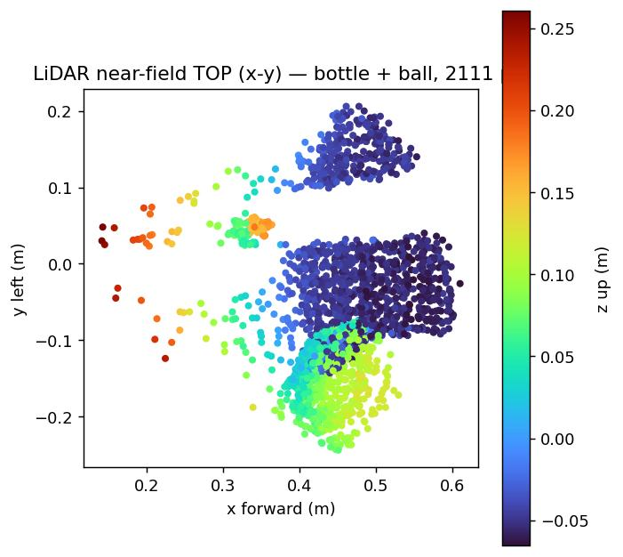
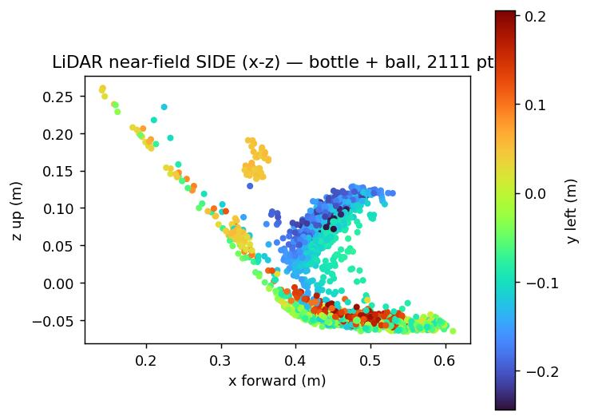
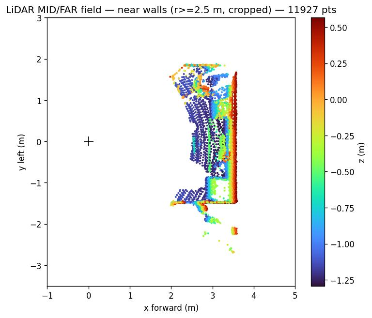

# LiDAR Sight

Singleton service for the Unitree G1 EDU's crown-mounted **Livox MID-360**,
exposing a few pure-geometry primitives (point cloud access, horizontal-plane
table detection, forward-corridor free-space check) that any mode can query
without fighting the device.

Provides the core singleton plus the `scene_map.py` occupancy grid +
goal picker + A\* planner that the navigation layer stands on top of.

## Calibration prerequisites

Before capturing reference data for tuning any LiDAR Sight constant (the
body-z table band, self-reflection radius, table-area thresholds), you
MUST prep the robot as follows. Skipping any of these produces misleading
data that propagates into downstream modes.

### 1. Remove the semi-opaque plastic face shield

The tinted face shield reduces LiDAR fidelity and clips the visible range.
Measured on 2026-04-16 — removing the shield doubled point count per frame
(60 k → 100 k) and extended visible x range from 3.6 m to 10+ m. Always
do calibration runs with the shield off.

### 2. Detach the harness straps and stow them high, out of LiDAR FOV

The walking-time harness straps hang down around the robot's face and show
up as two distinctive blue-ish blobs directly beside the robot base in
the top-down LiDAR view. They are so close to the sensor that they look
like a false occlusion, swamping the near-field points that actually
matter for table localisation. During calibration, pop the carabiners off
the robot's shoulder rings, gather the straps at the lift point above
the head, and verify their absence with a quick top-down scan before
proceeding.

### 3. Know the face-frame and lower-jaw occlusion artefacts

The LiDAR sits on the robot's crown inside a hemispherical dome. Its
effective FOV is CLIPPED by the robot's own head geometry:

| Occluder | What it blocks | Observable in the cloud |
|---|---|---|
| **Face frame** (vertical bars on either side of the face) | azimuth zones ±40°-45° forward | 0 points at ±40°-45° in a near-field azimuth histogram — the LiDAR sees nothing in those sectors |
| **Lower jaw / chin** (grey rectangular piece below the face) | everything at elevation < -10° down from LiDAR horizon | 0 points below elevation -10° — the real room floor (at body-z ≈ -0.78 m on a standing G1) is nearly invisible |
| **Dome housing / chin-edge** | self-reflection into the sensor | ~30 k points per frame at exactly `(0, 0, 0.416)` in body frame — all zero-range returns that cluster at the LiDAR origin. `SELF_REFLECTION_MIN_RADIAL_M = 0.15` drops these at capture time. |

Because the real floor is partly occluded, `find_tables()` uses an
absolute body-frame z range by default rather than a floor-relative
band. With the corrected mid360 frame (see below) the band is
`BODY_Z_TABLE_BAND = (-0.55, +0.40)`, centred on the standing
Regular-Mode G1's torso_link (~0.80 m above floor) so that coffee
tables (≈0.30 m tall → body-z ≈ -0.48 m) through standing desks
(≈1.10 m tall → body-z ≈ +0.32 m) are all in-band while the floor
(body-z ≈ -0.80 m) stays ~0.25 m below the lower bound. Pass
`find_tables(body_z_band=None)` to fall back to floor-relative
filtering on a robot or simulation where the full floor is visible.

### Calibration reference scene

The 2026-04-16 calibration session was the first end-to-end verification
that LidarSight correctly finds a real table. Future sessions should
reproduce this setup before touching the detection constants.

**Scene overview** — robot standing on carpet, bistro table 1 m in front
with a black water bottle on top. Table is 52 cm × 40 cm, 81.3 cm tall
(per physical measurement).

**The LiDAR's POV, looking forward out of the robot's face** — viewed from
directly behind the LiDAR dome. The dark wedges on the left and right are
the face-frame bars. The grey rectangular occlusion below the table is the
robot's lower jaw / chin. The bistro table (palette-shaped) and black
bottle are framed DEAD CENTRE by the face-frame opening — which is the
only sector where the LiDAR has any meaningful forward view.

**The robot's face from outside** — the face frame (glowing blue outline),
the lower jaw (grey rectangular piece below the mouth), and the harness
straps on either side of the head. Those dark straps used to create the
phantom blue blobs directly beside the robot base in our top-down LiDAR
plots before we detached them.

**An example rendered LiDAR frame** from the calibration run has six
panels showing top-down, zoomed top-down, side view, front view, z
histogram, and 3D. The bistro table shows up as the cyan circular blob
at `(x ≈ 1.0, y ≈ 0)` in the Top-down ZOOM.

> **Note:** numbers in that pre-fix rendered example predate the
> 2026-04-17 mid360 frame 180° roll correction (see "Body-frame
> transform" below). In that rendering the bistro table's z-histogram
> spike sits at body-z ≈ +0.72 m, which was an artefact of the flipped
> axes; post-fix it sits at body-z ≈ +0.04 m.

A re-calibration run on the **corrected** transform should produce:

- bistro table centroid at roughly `(1.0, 0, +0.04)` in torso body frame
- table area ≈ 0.13–0.17 m²
- floor dense spike at body-z ≈ -0.80 m (torso_link ≈ 0.80 m above floor)
- ~100-800 points on the table plane depending on accumulation

Deviations of more than a few cm suggest the transform, self-reflection
filter, or body-z band needs re-tuning.

## Hardware

| | |
|---|---|
| LiDAR | Livox MID-360 (360° × 52° vertical, 200 kpts/s native) |
| Driver | `lidar_driver` (root Unitree service, already running) |
| Transport | Cyclone DDS, topic `rt/utlidar/cloud_livox_mid360` |
| Message type | `sensor_msgs::msg::dds_::PointCloud2_` |
| Rate | 10 Hz, ~20 000 points per frame |
| Fields | x, y, z, intensity (float32) • ring (uint16) • time (float32) |
| Native frame | `livox_frame` (== URDF `mid360_link`) |

We do **not** talk to the Livox SDK directly. The root `lidar_driver`
service already handles the device's UDP 56000/56100 protocol and
republishes the cleaned cloud over DDS, so a user-space DDS subscriber is
all we need — no extra conda env, no TCP bridge, no second copy of the
driver competing for the device. This mirrors `depth_camera_sight`'s use
of Unitree DDS for the RGB stream.

## Body-frame transform

All consumer output is in torso body frame: **+X forward, +Y left, +Z up,
origin at `torso_link`**.

The LiDAR-to-body fixed transform is read at import time from the bundled
URDF (`arm_fk/urdf/g1_body29_hand14.urdf`, the same URDF `arm_fk`
uses — one source of truth for geometry across the repo). As of that
URDF:

```xml
<joint name="mid360_joint" type="fixed">
  <origin xyz="0.0002835 0.00003 0.41618"
          rpy="0 0.04014257279586953 0"/>
  <parent link="torso_link"/>
  <child  link="mid360_link"/>
</joint>
```

i.e. the LiDAR sits 41.6 cm above torso_link, essentially on the
centreline, with a 2.3° nose-down pitch.

### Physical-mount 180° roll correction (2026-04-17)

**The Livox MID-360 on this robot is physically mounted UPSIDE DOWN
inside the crown/helmet assembly.** That is the plain-language reason
the URDF's `rpy="0 0.0401 0"` above does not match the raw data. The
real raw cloud on `rt/utlidar/cloud_livox_mid360` arrives in a frame
that is rotated 180° about +X relative to the URDF declaration — both
its `y` axis and its `z` axis are negated. `lidar_sight` adds π to the
URDF-read roll at import time to correct for this, so consumer-facing
output is still clean torso-frame +X-forward, +Y-left, +Z-up.

How this was established on the physical robot (verified 2026-04-17):

1. **Table-top z-sign probe.** Bistro table top, physically 0.813 m
   above the floor (measured by tape), ~1 m directly in front of a
   standing G1 in Regular Mode. In the pre-fix raw `livox_frame` feed
   the table top registered at `z = +0.34 m`. That's impossible if
   `+z` were up — the LiDAR sits roughly at torso level, so a table
   top below it must be at negative z. The floor spike landed at
   `z = +1.15 m`, another densely-populated plane that could only be
   the floor if `+z` points down.
2. **Side-object y-sign probe.** User placed a ~1 m tall back-roller
   0.5 m to the robot's LEFT (body `+y`). Under a downward-only
   hypothesis (pure `z`-flip) the roller would appear at raw
   `y ≈ +0.50 m`; under a 180° X-roll it would appear at raw
   `y ≈ -0.50 m`. Observation: raw `y = -0.48 m` (median over 110
   points). Unambiguously ruled out pure z-flip in favour of the
   proper 180° roll.

Combined: the raw frame is related to the URDF-declared `mid360_link`
by a 180° rotation about the sensor's +X axis, which flips `y` and `z`
together and leaves `x` (forward) unchanged. Applying π of roll on top
of the URDF's pitch reproduces this exactly and makes the floor appear
at the measured body_z ≈ -0.80 m (i.e. torso_link ≈ 0.80 m above floor,
agreeing with depth_camera_sight's tape+SVD calibration of 1.242 m −
0.430 m = 0.812 m within 1 cm).

The URDF file is **not** modified — arm_fk and anyone else consuming
the URDF against a real-URDF-only tool (pinocchio, urchin, RViz) still
reads Unitree's as-shipped document. Only `lidar_sight.py` applies the
correction, and the override lives at a single constant
(`_MOUNT_CORRECTION_ROLL_RAD`) so a future driver fix can be dropped in
by setting it to 0.

If the URDF is missing at runtime (stripped-down deploy), hard-coded
fallback constants kick in. Warning: those are a snapshot and can drift
from the URDF over time — keep the URDF on the robot.

## Public API

```python
from lidar_sight import LidarSight

# First call spins up a background DDS subscriber and blocks up to
# warmup_timeout_s (default 5 s) for the first frame.  Subsequent calls
# return the same instance.
lidar = LidarSight.instance()

# Most-recent body-frame cloud.  Never blocks.  May return None if the
# service hasn't received a frame yet (rare after warmup).
cloud = lidar.latest_cloud()
cloud.points         # np.ndarray float32 (N, 3)  body-frame metres
cloud.intensities    # np.ndarray float32 (N,)    or None
cloud.timestamp      # float  time.monotonic() at frame arrival

# Geometric primitives — pure numpy, no ML.
tables = lidar.find_tables()
# Returns list[Table] sorted by (descending confidence, descending area):
#   center_xyz           (x, y, z) body frame metres
#   normal_xyz           unit plane normal (always +z for v1)
#   height_above_floor_m None when the floor could not be detected
#   area_estimate_m2     occupied-cells × cell²
#   confidence           0..1 (saturates around 500 points on a plane)
#   point_count          N points supporting the plane

# Convenience for a navigation caller: where should I walk toward?
target = lidar.nearest_table_in_front(max_distance_m=5.0,
                                       max_lateral_m=1.5)

# Free-space check for obstacle avoidance.  Checks points with
# x ∈ (0.05, forward_m], |y| ≤ half_width_m, z ∈ z_band.
clear, blocker = lidar.path_clear(forward_m=1.0, half_width_m=0.3)

lidar.shutdown()
```

### Flash-scan pause/resume + waist-yaw stitching (2026-05-13)

`LidarSight` supports the flash-scan blind-spot fill used by the
navigation caller's blind-spot sweep.  The pattern is:

```python
lidar.set_waist_yaw_provider(torque_monitor.waist_yaw)   # fallback for non-paused paths
lidar.pause()              # _on_msg drops every incoming DDS frame
lidar.flush_accumulator()  # discard any in-flight frames

for target in (+0.611, -0.611, 0.0):                     # ±35° torso swivel
    arm_ctrl.set_waist_yaw(target, settle_s=1.1, clamp_rad=0.611)
    time.sleep(1.1)
    lidar.resume(commanded_waist_yaw=target)             # accept frames, counter-rotate by exact value
    time.sleep(0.5)
    lidar.pause()

lidar.resume(commanded_waist_yaw=0.0)                    # back to live mode
```

While paused, the DDS subscriber stays alive but `_on_msg` discards
every frame — no smeared mid-ramp returns enter the accumulator.
While resumed, each frame is counter-rotated **by** `+commanded_waist_yaw`
(rotate body-frame XY by the exact commanded angle, not a live
`motor_state[12].q` read that could include servo overshoot) into the
leg/IMU frame.  Accumulator depth bumped to 30 frames to retain all
three commanded angles' captures without rolling them out.

* `pause()` — stop accumulating; DDS subscriber stays running.
* `resume(commanded_waist_yaw=None)` — accept frames; when a value
  is supplied, frames are counter-rotated by that exact angle.
  Pass `0.0` (not None) when explicitly capturing at upright.
* `flush_accumulator()` — discard buffered frames.  Useful around a
  flash-scan so stale frames from before the sweep don't contaminate
  the captured set.
* `set_waist_yaw_provider(callable)` — fallback for non-pausing
  callers (e.g. continuous-monitoring uses where the torso may drift
  but never executes a deliberate sweep).  Pass
  `LowStateMonitor.waist_yaw` (bound method).  Overridden when a
  `commanded_waist_yaw` is in effect.

For tests / off-robot CI, use `MockLidarSight` — same public surface,
synthesises a floor disc plus an optional rectangular table slab:

```python
from lidar_sight import MockLidarSight

lidar = MockLidarSight(table_xyz_m=(1.8, 0.0, -0.05),
                        table_size_m=(0.6, 0.9))
# lidar.set_table((2.5, 0.8, 0.02), size_m=(0.8, 1.0))  # move it
```

## Algorithm (v1)

`find_tables()` is ~100 lines of pure numpy:

1. **Voxel-downsample** to ~5 cm — bounds point count, eliminates per-ring
   double-counting.
2. **Estimate floor z**: histogram all z values in ±2 m, pick the
   **densest** bin in the body-frame band `[-1.50, -0.30] m` (the
   range where the floor physically lives for any G1 stance).  "Floor"
   here means "whatever horizontal surface is under the robot" — the
   room floor when standing, the cart deck when parked on a cart.
   Returns None if no bin qualifies.

   **(2026-05-13):** changed from "lowest bin with ≥ threshold"
   to "densest bin in [-1.50, -0.30] band".  The old picker selected
   a spurious low-z spike at z≈-1.25 (chin reflection) over the real
   floor cluster at z≈-1.05 (9× denser), shifting the nav band
   `[floor+0.05, floor+1.35]` downward by ~20 cm.  Real floor returns
   then fell INSIDE the nav band and got classified as `OBSTACLE` —
   the robot ended up standing on a "red OBSTACLE" cell and every
   A* plan bailed with `no_path`.  The body-frame-anchored band is
   robust to chin reflections (below -1.50) AND to wall-shoulder
   density peaks at z≈0 (above -0.30).
3. **Filter to the table band** above the floor: default 0.55 to 1.15 m.
   If no floor is detected, fall back to an absolute torso-frame band
   `[-0.35, 0.35]` m.
4. **2D-grid** the band-filtered points at 5 cm cells. Each occupied cell
   becomes one pixel in a binary occupancy image.
5. **Connected components** on the binary grid. Each blob is a candidate
   horizontal surface. 4-connectivity via `scipy.ndimage.label` when
   available; pure-numpy union-find fallback otherwise.
6. **Reject** blobs that fail any of:
   - Fewer than `MIN_TABLE_PLANE_POINTS=40` points.
   - Fewer cells than `MIN_TABLE_AREA_M2=0.10` m² worth (40 cells).
   - Z-stddev within the blob greater than `max_plane_z_std_m=0.08` m
     — this is what rejects walls (a wall in the band has high z-spread)
     and keeps tables (which have nearly-constant z).

Surviving blobs are returned as `Table` objects. Sorting is by
confidence, then area.

### Why no RANSAC

The issue called out RANSAC + height band + clustering. The v1
implementation replaces RANSAC with a flatness test on a 2D-connected
blob: every xy cell in the band contributes, and a blob is accepted only
if its z-spread is small. This is equivalent to RANSAC on a horizontal
plane (normal = +z, distance threshold = `max_plane_z_std_m`) when the
plane orientation is known, but cheaper and easier to reason about. If a
future use case needs tilted tables, swap this out for a plane-SVD fit
per blob without changing the public API.

## Bringup & validation

Run the built-in diagnostic on the robot under the `unitree_deploy`
conda env:

```bash
ssh unitree@192.168.123.164             # password: 123
source /home/unitree/miniconda3/etc/profile.d/conda.sh
conda activate unitree_deploy
cd /home/unitree/robotics-connect/lidar_sight

# Live: prints frame rate, cloud shape, and a find_tables() pass
python3 lidar_sight.py --frames 20

# Deeper scene probe: z histogram + floor estimate + find_tables at
# several bands.  Useful when the robot is in an unfamiliar posture.
python3 _diag_scene.py --accumulate 5

# Off-hardware: run everything against MockLidarSight
python3 lidar_sight.py --mock
```

### Scene-map + planner diagnostic

The `scene_map.py` module adds a top-down occupancy grid, a bucketed
goal-table picker, and an A\* path planner — the scene-map algorithm,
named for its NES-era dungeon-grid resemblance.  The runbook is below.

Live-test the whole pipeline against the current scene:

```bash
# Live on the robot — 10-frame accumulation, default clearance (0.22 m).
# Writes a per-frame JPEG with the raw cloud, occupancy grid, planned
# path, and a text summary.
python3 _diag_plan.py --n 3 --accumulate 10 --out /tmp/plan_frames

# Dense obstacle course (gaps ≤ 0.40 m): reduce clearance to ~0.18 m,
# the observed minimum before the inflated-OBSTACLE walls pinch shut.
python3 _diag_plan.py --n 3 --accumulate 10 --clearance-m 0.18

# Test path geometry without depending on find_tables (useful when it's
# flaky on this scene): force a specific (x, y) goal.
python3 _diag_plan.py --n 1 --goal-xy 3.0 -0.1 --out /tmp/plan_frames

# Off-hardware mock pipeline for unit-test-style validation
python3 test_scene_map.py
```

**Clearance-tuning notes.**  The G1 EDU's nominal walking half-width is
≈ 0.175 m, so the theoretical minimum clearance is ≈ 0.18 m; default
is 0.22 m, leaving ~4.5 cm of slack.  On the dense obstacle course
(paper shredder + filing cabinets + piano + bookshelves + standing desk
all within 3–3.5 m), the narrow passages require the full 0.18 m
setting — at 0.20 m A\* finds no path for any frame.  On a typical
home/office scene with ≥ 0.60 m gaps, use the 0.22 m default.


### Validation matrix

| Check | Status |
|---|---|
| `latest_cloud()` returns non-empty cloud within 2 s | **PASS** — ~20 k pts/frame, 10 Hz, ~67 k pts per 5-frame accumulator after self-reflection filtering; first frame typically <200 ms after `instance()` |
| Body-frame transform applied in capture thread | **PASS** — raw `livox_frame` never exposed; `SELF_REFLECTION_MIN_RADIAL_M=0.15` drops the ~30 k/frame dome returns |
| `find_tables()` rejects floor | **PASS** in `body_z_band=None` mode with a visible floor; on this robot the floor is occluded so the absolute body-z band implicitly excludes it |
| `find_tables()` rejects walls | **PASS** — z-flatness test (`max_plane_z_std_m=0.08`) rejects vertical structures |
| `--mock` runs end-to-end without hardware | **PASS** — `MockLidarSight()` default scene (bistro table at body-z=+0.04 m, 52×40 cm) detects correctly |
| `find_tables()` detects a real table | **PASS** (2026-04-17, post-fix) — bistro table placed 1 m in front of a standing G1 detected at `(x=1.025, y=-0.010, body-z=+0.035)`, area 0.13 m², 94 points. The body-z is within 2.6 cm of the geometrically-predicted value given the LiDAR-derived floor at -0.804 m. |
| Body-frame transform cross-check to ±5 cm | **PASS** (2026-04-17) — after the `_MOUNT_CORRECTION_ROLL_RAD` fix, the LiDAR-derived torso_link height (0.804 m above floor) agrees with `depth_camera_sight`'s independently-measured value (0.812 m, tape + SVD) to within **0.8 cm**. The bistro table body-z is within **2.6 cm** of its geometrically-predicted value. Both well inside the ±5 cm gate. |
| Y-axis handedness | **PASS** (2026-04-17) — back-roller placed 0.5 m to robot's LEFT (body +Y) detected at body +Y side (123 points) with zero points on body -Y. Pre-fix it would have appeared on body -Y. |

## Pitfalls

1. **Face shield on + harness straps attached = bad calibration data.**
   See the Calibration Prerequisites section above. Skipping either of
   those steps produces a cloud that looks superficially reasonable but
   misses ~40 % of the scene (shield) and dumps phantom blobs right
   beside the robot base (straps). Re-run calibration after any
   physical change to the robot's head or harness configuration.
2. **`ChannelFactoryInitialize` is a process-global.** LidarSight guards
   it with `_CHANNEL_FACTORY_INITED` like `depth_camera_sight` — so
   importing both in one process is safe.
3. **Cloud frame is `livox_frame` on the wire.** `_on_msg` applies the
   mount transform AND drops self-reflection points before storing, so
   consumers ONLY ever see body-frame data, with the dome self-returns
   already filtered. Do not bypass `latest_cloud()`.
4. **Floor is effectively invisible on THIS robot.** The lower jaw /
   chin assembly blocks everything below elevation -10° from LiDAR
   horizon, so only a handful of points per frame survive below body-z
   = 0. `find_tables()` uses an absolute body-z band instead of
   floor-relative by default. On a robot without chin occlusion,
   `find_tables(body_z_band=None)` re-enables floor-relative filtering.
5. **`path_clear()` returns True when cloud is empty.** Fail-open is
   intentional: do not block callers on a temporary LiDAR hiccup. The
   caller should check `cloud.timestamp` staleness if that matters.
6. **`lidar_driver` runs as root.** Do not `kill`, `systemctl stop`, or
   `chown` anything under the root service. If the topic vanishes,
   power-cycle the robot.
7. **Do not deploy via rsync.** Use `scp`. rsync has bitten us before
   with permission drift on the `/home/unitree/robotics-connect/` tree.
8. **Motion compensation is NOT applied.** A spinning LiDAR frame takes
   ~100 ms to accumulate; if the robot is walking, the points are
   smeared. Acceptable for stationary table detection; for walking
   integration this will need the body IMU integrated over the frame
   window.

## Relationship to other modes

- **Target selection**: a caller queries `lidar.find_tables()` to pick a
  target to walk toward, then hands off to the depth camera for the grasp.
  LiDAR can also be a retrieval-key input (voxelised cloud or flat
  occupancy grid feature).
- **Forward obstacle check**: `lidar.path_clear()` is a forward obstacle
  channel, and `lidar.nearest_table_in_front()` gives a navigation caller
  something to walk toward instead of blindly forward 3 m.
- **Mapping / Perception**: LiDAR Sight is the underlying sensor service;
  mapping accumulates its scans; perception runs feature analysis on the
  accumulated cloud.
- **Depth Camera Sight**: complementary near-field service. LiDAR finds
  the table at 3 m; depth cam takes over inside 1 m.

## Files

| File | Purpose |
|---|---|
| `lidar_sight.py` | Module source: `LidarSight` + `MockLidarSight` + geometry primitives |
| `_diag_scene.py` | On-robot scene probe (used during bring-up) |
| `README.md` | This file |

## Sample capture (on-robot, 2026-06-03)

Captured live on a G1 EDU during robotics-connect verification. The MID-360 is
crown-mounted and **180° roll-corrected** in software (see the mount-correction
section above), so all coordinates are body frame (+x forward, +y left, +z up),
robot base at the `+`.

### Near field — the bottle + ball on the table directly ahead

Two views of the same close cluster (~0.1–0.6 m forward, just below head
height). The bottle reads as a tall, narrow return (z up to ~0.26 m); the ball
as a rounded profile beside it (~0.2 m to the robot's right).

| Top (x-y) | Side (x-z) |
|---|---|
|  |  |

### Mid/far field — room walls



`r ≥ 2.5 m`, cropped to the room walls (the L-shaped wall ~2–3.5 m ahead). The
robot also sees ~2 m forward / 45° right **through a pair of glass french
doors**; those through-glass returns (out to ~11 m) are excluded here.

Floor estimated at **−1.24 m**; in the wider scan a 1.42 m² table was detected
~2 m ahead at confidence 1.00.
